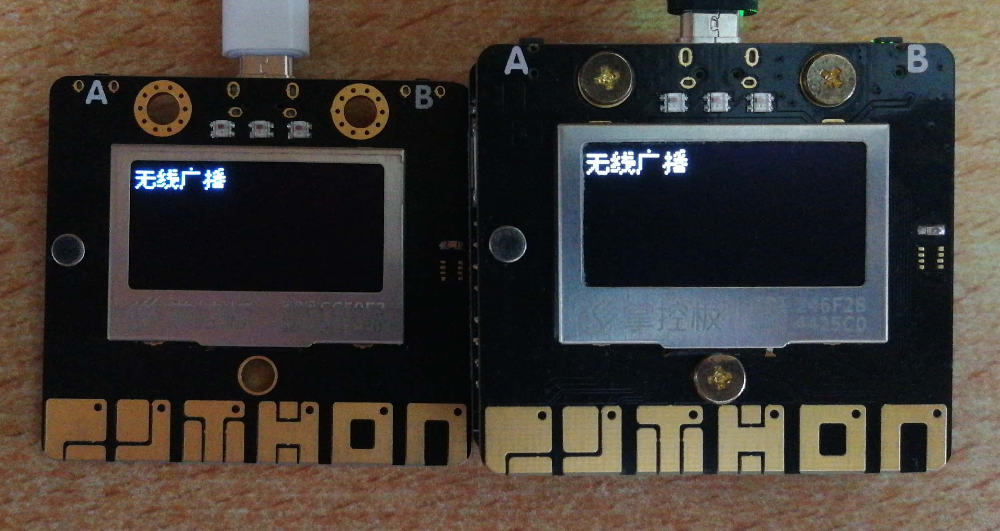
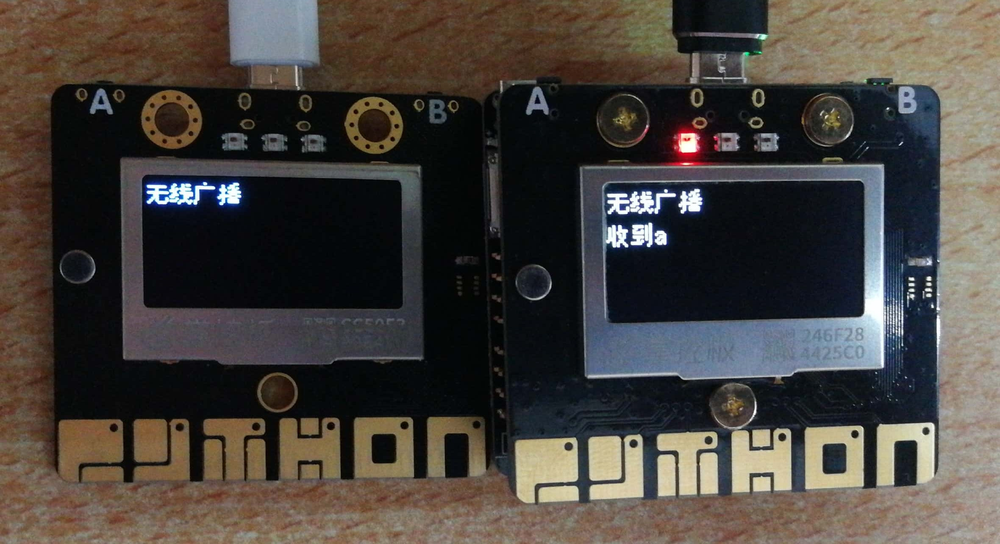
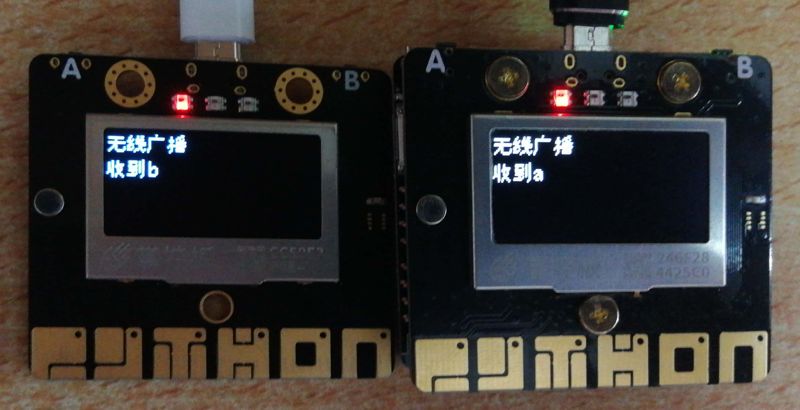

掌控板的无线广播功能详解
=================================

掌控板支持无线广播功能，不需要连接Wi-Fi，多块掌控板之间可以通讯。

具体步骤
--------------

1.准备好掌控板及数据连接线，打开mPythonX 0.3.2，连接串口。

2.完成其中一个掌控板程序代码，图形代码如下。

.. image:: ../image/songda/radio-01.jpg

提示：

（1）其余掌控板代码程序与上图类似。

（2）多个掌控板的无线广播频道需一致。

3.刷入程序，运行效果如下。

示例代码
-------------

https://github.com/vvlink/SIoT/blob/master/examples/Python/radio.xml
