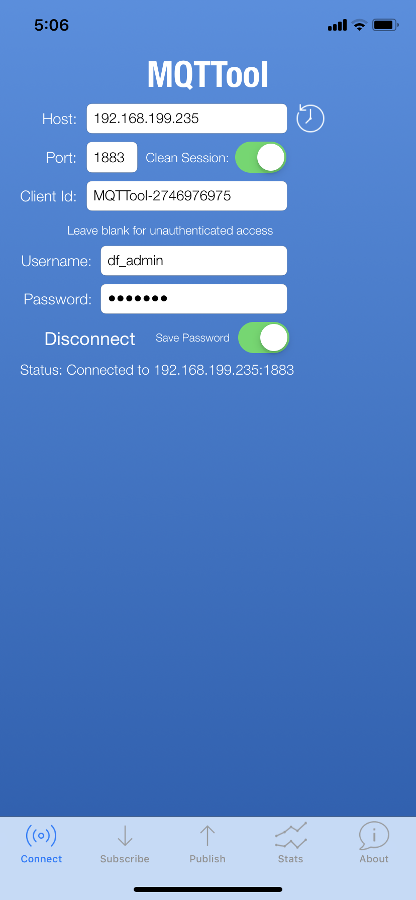
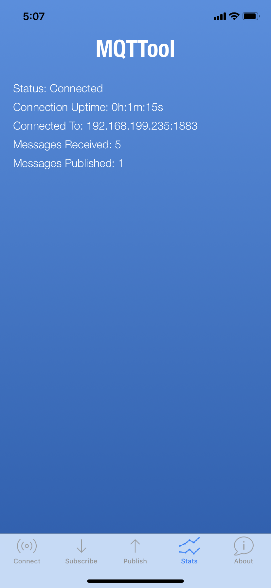
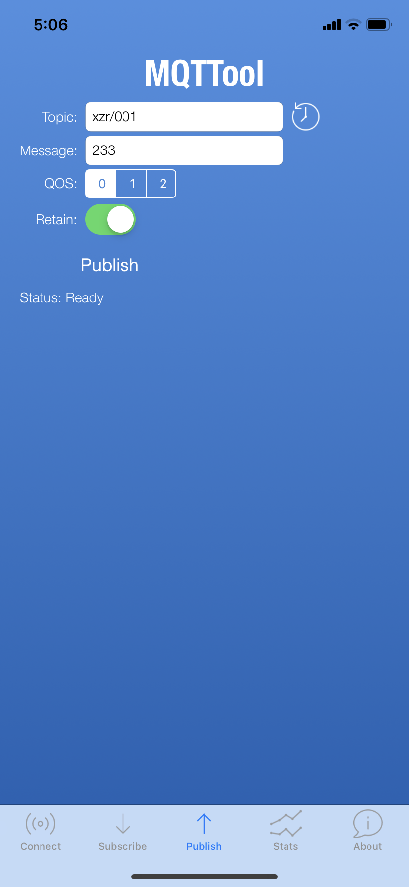
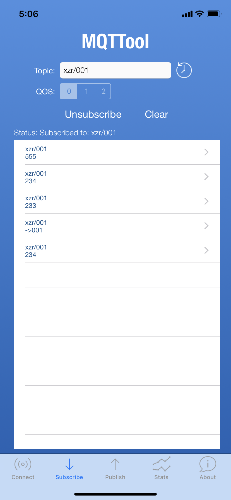

常见MQTT客户端
=========================

MQTTBox（PC端）
---------------------------

MQTTool（iPhone手机）
---------------------------

MQTTool是运行在iPhone上的MQTT客户端软件，也是一个MQTT测试工具。通过App Store即可安装。

首先要确认计算机和手机连接的是同一个无线路由器，或者在同一个局域网中，相互之间可以访问。输入计算机的IP地址和用户名、密码，点击“Connenct”即可连接。

点击“Stats”，可以查看服务器的连接状态。

在“Topic”（主题）中输入“xzr/001”（表示项目id为xzr，设备id为001），点击“Publish”（发送）即可发送消息。在SIoT的Web页面可以看到这一消息。

同样，在Web端给Topic“xzr/001”发送消息，手机端即可收到信息，在“Subscribe”（订阅）。

多个手机同时连接这个MQTT服务器，只要Topic相同，相互之间都能收到。

MQTTool（安卓手机）
---------------------------
