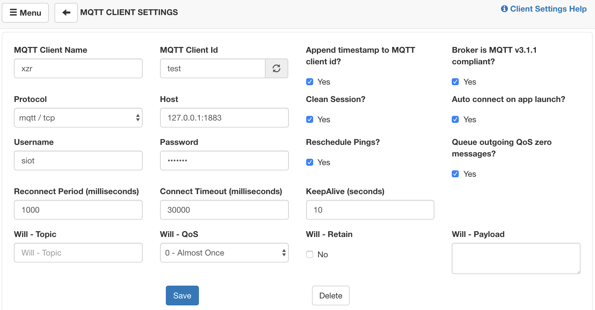

常见MQTT客户端
=========================

MQTTBox（PC端）
---------------------------

MQTTBox是一款很好用的MQTT客户端调试工具，支持在Windows、Mac和Linux上面运行。

GitHub地址：https://github.com/workswithweb/MQTTBox

首先要设置MQTT服务器信息，如图所示，除了服务器地址、用户名、密码和Protocol外，其他的地方都可以用默认值。

在这个界面中，连接服务器后，就可以给名称为“xzr/003”的Topic发送消息和订阅消息了。

在Web管理界面中，就能看到自动建立的项目中多了“xzr”，设备中多了“003”，通过网页就可以查看所有的消息记录。

.. image:: ../image/demo/01_mqttbox_03.png

**注意**

  - 客户端发送的消息，所有订阅了这一主题的客户端都能收到，包括自己；
  - “xzr/003”这个Topic不需要事先设置，只要发过一次消息，SIoT会根据这一Topic自动建立项目名称和设备名称，方便管理；
  - 通过Web给Topic发送消息，如果不想将这一消息记录在数据库中，可以在前面加上“->”的标志。

MQTTool（iPhone手机）
---------------------------

MQTTool是运行在iPhone上的MQTT客户端软件，也是一个MQTT测试工具。通过App Store即可安装MQTTool。

.. image:: ../image/demo/01-mqtt-01.png

首先要确认计算机和手机连接的是同一个无线路由器，或者在同一个局域网中，相互之间可以访问。输入计算机的IP地址和用户名、密码，点击“Connenct”即可连接。

- 图中的username应填写siot

.. image:: ../image/demo/01-mqtt-02.png

点击“Stats”，可以查看服务器的连接状态。

.. image:: ../image/demo/01-mqtt-03.png

在“Topic”（主题）中输入“xzr/001”（表示项目id为xzr，设备id为001），点击“Publish”（发送）即可发送消息。在SIoT的Web页面可以看到这一消息。

.. image:: ../image/demo/01-mqtt-04.png

同样，在Web端给Topic“xzr/001”发送消息，手机端即可收到信息，在“Subscribe”（订阅）。

多个手机同时连接这个MQTT服务器，只要Topic相同，相互之间都能收到。

MQTT Client（安卓手机）
---------------------------

MQTT Client 是一款安卓环境的MQTT客户端软件，也是一个MQTT测试工具。可以在http://www.mdpda.com/app/apk7623192.html下载。

首先要确认计算机和手机连接的是同一个无线路由器，或者在同一个局域网中，相互之间可以访问。

打开软件，点击右上角的Settings，点击Server。

- 在URL处输入计算机的IP地址，后面跟上“：8080”

- Port填写1883

- Username填写用户名（siot）

- Password填写密码（dfrobot）

- 其他内容保持默认就可以了

发送消息需要在主页面点击右下角的紫色按钮，进入发送消息界面。

在“Topic”（主题）中输入“xzr/001”（表示项目id为xzr，设备id为001），在“Message”（消息）中输入想要发送的消息内容，点击“PUBLISH”（发送）即可发送消息。在SIoT的Web页面可以看到这一消息。

同样，在Web端给Topic“xzr/001”发送消息，手机端即可收到信息，这一消息在主页面可以订阅。

在主页面下方输入想要订阅的主题“xzr/001”，就可以获取实时消息了。

多个手机同时连接这个MQTT服务器，只要Topic相同，相互之间都能收到。
