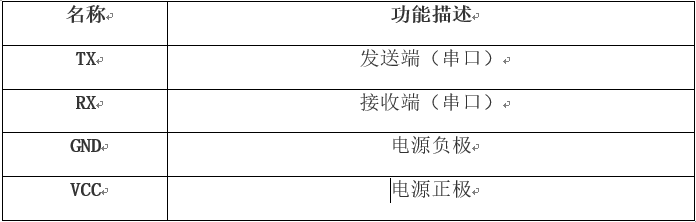

Arduino+OBloq
=========================

Arduino简介
---------------------
    Arduino是一款灵活便捷、易于上手的开源硬件，包含硬件部分（各种符合Arduino规范的电路板）和软件部分（一套整合的开发环境软件）两个部分。
    Arduino既可用来开发独立运作并具有互动性的电子产品，也可开发与PC相连的周边装置，同时能在运行时与PC上的软件进行交互。

OBloq模块简介
---------------------
    OBLOQ是一款基于ESP8266设计的串口转WIFI物联网模块，用以接收和发送物联网信息。模块尺寸紧凑，价格低，接口简单，即插即用，适用于3.3V~5V的控制系统。
    OBLOQ模块具备的两个基础功能：发送数据到物联网和接收物联网数据。即：
      1.Arduino读取温度传感器的数据，通过OBLOQ模块发送温度数据到物联网设备。
      
      2.物联网设备发送数据，OBLOQ接收数据并发送给Arduino,Arduino再通过串口显示接收的数据。
      
      OBloq模块通过wifi连接上网，收发数据。联网后，当检测到有最新版固件时，Obloq会自动升级。

 当OBloq处于正常工作时，Obloq上LED灯为绿色常亮，升级时为白色；当Obloq升级结束后，指示灯由白色变成红色，此时需要重启主控版，使得Obloq最新固件生效。
 其端口连接如下：

 

Arduino+OBloq
---------------------
将Arduino UNO主控板与OBloq模块结合，就等于搭建了一个智能设备。即：主控板 + 物联网模块 = 智能设备

硬件连接
---------------------

参考代码
---------------------
