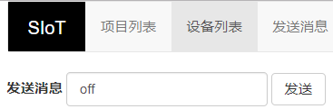
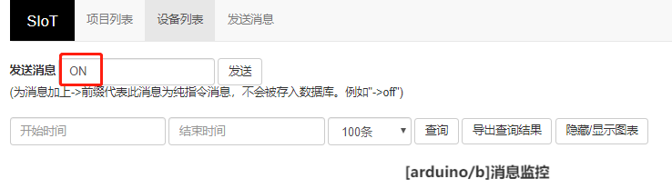

SIOT简介
=========================
    
    SIoT是一个为中小学STEM教育定制的跨平台的开源MQTT服务器程序，S指科学（Science）、简单（Simple）的意思。SIoT重点关注物联网数据的收集和导出，是采集科学数据的最好选择之一。

那什么是物联网？什么又是MQTT呢？

1.1 物联网
---------------------

    物联网（Internet of Things，缩写IoT）是互联网的一个延伸，互联网的终端是计算机（PC、服务器），而物联网的终端是硬件设备，无论是家电、工业设备、汽车、监测仪器，所有这些终端都可以互联，可以总结为万物互联。

1.2 MQTT
---------------------

    MQTT（Message Queuing Telemetry Transport，消息队列遥测传输协议）是一个基于客户端-服务器的消息发布/订阅传输协议。
    MQTT协议是轻量、简单、开放和易于实现的，这些特点使它适用范围非常广泛。

1.3 MQTT
---------------------

    SIoT为“虚谷物联”项目的核心软件，是为了帮助中小学生理解物联网原理，并且能够基于物联网技术开发各种创意应用。

安装运行
=========================

2.1 SIOT软件下载
---------------------

   下载地址：http://mindplus.dfrobot.com.cn/siot
   根据自己电脑的系统，对应下载SIoT软件压缩包，例如Windows系统下载win32。

2.2 SIOT软件准备
---------------------

    SIoT是一个绿色软件，将下载的压缩包解压并打开。

   由于Mind+目前只支持Windows下Win7及以上版本，本篇教程将以SIoT_win32为例，讲述如何使用Mind+软件实现SIoT操作。
   
2.3 Mind+软件下载
---------------------

    Mind+是一款基于Scratch3.0开发的青少年编程软件，支持arduino、micro:bit、Uno板等各种开源硬件，只需要拖动图形化程序块即可完成编程，还可以使用python/c/c++等高级编程语言，让大家轻松体验创造的乐趣。
   下载地址：http://mindplus.cc
   
**本教程使用的是Mind+1.5.5版本软件**

2.4 Mind+软件安装
---------------------

**2.4.1 安装软件**

双击下载的文件完成软件安装。

**2.4.2 安装驱动**

STEP1：打开Mind+软件，点击“教程”——“视频教程”打开教程。

STEP2：打开“安装驱动”视频教程。
   

STEP3：根据视频悬浮窗中的教程，一键安装驱动，这一步很重要！安装一次，一劳永逸！

快速入门
=========================

   本篇教程将以win10系统为例，通过几个简单的程序案例，以Arduino Uno主控板（后面简称Uno板）为智能终端，分别介绍在Mind+软件中实时模式和上传模式下如何运行SIoT。

3.1 实时模式
---------------------

在实时模式下，按照是否连接Uno板，又可分为两种情况。

**3.1.1 实时模式，不连接Uno板**

   在实时模式下不连接Uno板时，SIoT平台可与软件界面的舞台互动。
   
   项目案例：在SIoT平台输入消息，舞台角色说出消息内容

   项目实现步骤：如下STEP1-STEP9。如果是第一次使用SIoT，请严格按照以下步骤进行操作。

*STEP1 运行SIoT系统*
   
  双击运行SIoT_win.exe，可以看到一个黑色的CMD窗口。

  * 使用SIoT过程中一定不要关该窗口

*STEP2 电脑连接WIFI*

  将电脑连接到WIFI。

  * 提供WIFI的路由器或手机热点可以不连接互联网，因为使用SIoT实现物联网应用时，只需要使用路由器或手机热点建立一个局域网即可。

*STEP3 获取电脑IP*

   电脑每次连接WIFI，都会生成一个IP地址，每个IP地址对应的电脑都是唯一的。运行SIOT程序后会在电脑上建立一个SIOT服务器，其他设备要访问这个服务器，需要知道这个SIOT服务器所在电脑的IP地址。
    
   获取电脑IP的方法有很多，可在网页上搜索到，下面我们来介绍其中一种简易操作方法，通过以下3步获取电脑IP。

1、同时按下键盘上“WIN”+“R”，弹出如下运行窗口。

.. image:: ../image/zhangyu/Arduino/arduino-13.png

2、输入“cmd”，点击确定，弹出小黑框。

.. image:: ../image/zhangyu/Arduino/arduino-14.png

.. image:: ../image/zhangyu/Arduino/arduino-15.png

3、在小黑框中输入“ipconfig”，点击键盘“enter”，在小黑框中可以看到IP地址，如下图IP为192.168.9.191。

.. image:: ../image/zhangyu/Arduino/arduino-16.png

* 每次连接不同的WIFI，电脑的IP地址都可能会发生变化，需要通过上述方法重新获取。

*STEP4 打开SIoT网页端*

1、打开电脑浏览器，在网址栏输入在“STEP3”中获得的IP地址加上“:8080”，如：192.168.9.191:8080

* “:” 需在在英文输入法下。

2、点击键盘enter键，打开即为SIoT网页端，如下图：

3、打不开怎么办？

￭ 检查siot的小黑窗是否打开

￭ 检查ip地址是否错误，如果有多个ip地址就一个一个尝试

￭ 关闭网络防火墙

*STEP5 登陆SIoT网页端*

账号：siot

密码：dfrobot

输入账号、密码后，点击“登陆”，登陆后页面如下：

* SIoT网页端账号、密码都是统一的。

*STEP6 Mind+编程*

实现功能：在SIoT平台输入消息，舞台角色说出消息内容。

1、打开Mind+软件（1.5.5及以上版本），选择“实时模式”：

2、点击“扩展”：

3、选择“网络服务”，点选“MQTT服务”后点击“返回”：

4、编写程序：

5、设置MQTT初始化参数：

*STEP7 运行程序*

点击绿旗或主程序运行程序，可以看到角色会先说“OK”2秒，再说“hello”2秒。

说“OK”表示MQTT连接成功，说“hello”表示MQTT成功发送消息“hello”到Topic_0中。

*STEP8 在SIoT网页端查看消息*
    
打开SIoT网页端，点击“设备列表”，可以看到“项目ID”、“名称”对应为程序中自定义Topic_0的信息。

点击“查看消息”，在弹出窗口中可以看到设备的MQTT消息记录：

如上图，为程序中对Topic：“arduino/a”的消息记录，可看到消息内容和发送时间。

*STEP9 项目功能实现：在SIoT平台输入消息，舞台角色说出消息内容*

例如：在“发送消息”栏发送“你好啊”，舞台角色对应说出“你好啊”。

    至此就完成了在Mind+实时模式下SIoT与舞台的互动啦，但是所谓物联网，不连接外部硬件设备到物联网平台，又怎么能体现出它的优势呢！所以接下来，让我们通过加入Uno板一起来体验SIoT对硬件的控制。

**3.1.2 实时模式，连接Uno板**

    在Mind+实时模式下，加入Uno板，SIoT平台可以采集Uno板上传感器的数据，也可以控制Uno板的声、光、动输出、

    项目案例：在SIoT平台输入消息，控制点亮或熄灭Uno板的LED灯。

.. image:: ../image/zhangyu/Arduino/arduino-30.png

    项目实现步骤：STEP1-STEP8。

*STEP1-5与3.1.1相同*
    
*STEP6 连接Uno板*

   将Uno板通过USB线连接到电脑，在Mind+中“连接设备”下点击对应COM口。

.. image:: ../image/zhangyu/Arduino/arduino-30.png

在连接设备前可看到提示“未连接设备”。连接成功后，可看到对应COM口和提示“设备连接成功”。             。

*STEP7 修改程序*
    
1、在“扩展”中“主控板”下选择“Uno板”：

2、程序修改如下：

*STEP8 功能实现*

发送“on”，灯亮；发送“off”，灯灭。

.. image:: ../image/zhangyu/Arduino/arduino-36.png

3.2 上传模式
---------------------

   想象一下，将Uno板应用在家庭物联网中：使用温度传感器进行测量房间内的温度，并将其与Uno板进行连接，并上传到SIoT中，结果将以数值与折线图的形式展现，便于主人监测数据。要如何用程序实现呢？

   在3.1.2中，在Mind+实时模式下只能实时控制一块Uno板，如何在控制Uno板的同时进行温度测量呢？

   Mind+的上传模式是一个很好的选择，让我们一起来学习如何实现。

   实现步骤：STEP1-STEP8。

   所需材料：Uno板，温度传感器，OBLOQ物联网模块（模块介绍详见4.3.2）。

* 因为Uno板在SIoT需要通过物联网采集数据，但是Uno板不具备物联网通讯功能，因此需要借助OBLOQ物联网模块。

*STEP1-5与3.1.1相同*
    
*STEP6 Mind+软件设置*
    
   1、打开Mind+软件（1.5.5及以上版本），选择“上传模式”：

   2、点击“扩展”，在“主控板”下选择“Uno板”：
   
.. image:: ../image/zhangyu/Arduino/arduino-39.png
   
   3、点击“扩展”，在通信模块下选“OBLOQ物联网模块”：

*STEP7硬件连线图*

OBLOQ模块：TX、RX、GND和VIN引脚分别连接到D10、D11、GND和VCC引脚。

温度传感器LM35：A0引脚。

可通过修改程序来自定义相关引脚。

.. image:: ../image/zhangyu/Arduino/arduino-41.png

*STEP8编写程序*

.. image:: ../image/zhangyu/Arduino/arduino-43.png

   程序中指令中热点的名称、密码需要对应填写与电脑连接的wifi。

   Uno板：发送消息“ON”和“OFF”到Topic_1，点亮和关闭13口LED。

   温度传感器功能：实时采集温度并通过mind+进行读取计算发送到Topic_0，并在网页端显示。

   点击“上传到设备”将程序下载到Uno板中。	

*STEP9功能实现*

   Uno板在下载完程序后，OBLOQ物联网模块指示灯显示为绿色，表示成功与Uno板连接成功正常工作。

程序运行时，若无法连接OBLOQ物联网模块（指示灯不为绿色），先检查参数有没有填错，例如ip错误、Topic中有没有斜杠，依旧无法连接的话，可尝试关闭电脑防火墙，重新上传程序；若依旧不成功需要查看OBLOQ模块的接线对应的管脚是否连接正确。

   打开SIoT网页端，可以在“设备列表”下看到对应的Topic信息。
   

1、点击上图中“a”后的“查看消息”，可以看到温度传感器实时收集的温度值。

.. image:: ../image/zhangyu/Arduino/arduino-46.png

2、点击“b”后的查看消息

.. image:: ../image/zhangyu/Arduino/arduino-47.png

在弹出窗口中发送消息“ON”，可以看到Uno板子的LED被点亮。

.. image:: ../image/zhangyu/Arduino/arduino-48.png

同理，发送消息“OFF”，可以看到Uno板子的LED被点亮。

教程总结
=========================

4.1 SIOT操作流程汇总
---------------------

4.2 物联网框图
---------------------

以路由器建立无线局域网为例，通过下面这张图可以说明SIoT的作用原理。

在一台电脑上建立SIoT服务器后，其他设备在知道路由器分配给这台电脑的IP地址后，可以利用WIFI访问SIoT服务器。这些设备可以是电脑、手机、Uno板等。

.. image:: ../image/zhangyu/Arduino/arduino-50.png

4.3 小贴士-服务器信息
---------------------

**4.3.1 服务器信息**

SIoT启动后，你的计算机就成为了一个标准的SIoT服务器，使用任何一款SIoT客户端程序就可以访问。

￭ 服务器地址：计算机局域网IP地址

￭ SIoT端口：1883

￭ 用户名：siot（小写）

￭ 默认密码：dfrobot（小写）

￭ 消息主题（Topic）：项目名/设备名（可以自定义，中间的“/”为英文输入法且不可缺少。）

￭ Web管理地址：http://计算机IP:8080

**4.3.2 OBLOQ模块介绍**

    OBLOQ是一款基于ESP8266设计的串口转WIFI物联网模块，用以接收和发送物联网信息。接口简单，即插即用，适用于3.3V~5V的控制系统。OBLOQ物联网模块当没有连接wifi的时候，OBLOQ指示灯显示红色，正在连接wifi时显示蓝色，连接到wifi后，OBLOQ指示灯显示绿色。
    
OBLOQ物联网模块引脚说明：

.. image:: ../image/zhangyu/Arduino/arduino-51.png

OBLOQ物联网模块在使用中的常见问题：

1) OBLOQ指示灯一直显示蓝色：

表示OBLOQ正在连接wifi，需要一定时间，如果超过一分钟依然显示蓝灯，则可能为wifi账号密码设置错误，请检查程序 。

2) OBLOQ指示灯一直显示紫色：

表示OBLOQ的wifi连接成功但是mqtt异常断开，尝试检查所在wifi是否断网，也有可能easyiot服务器问题，等待一会儿再连接或联系论坛管理员。 

3) OBLOQ指示灯一直显示红色：

表示OBLOQ的wifi连接不成功，尝试检查是否tx和rx接反了（调换一下tx和rx接线顺序），或者是wifi有问题（使用手机开热点，不要用中文WIFI名称），然后就是参数有没有填错（物联网网站里面的参数）。 

4.4 更多创意
---------------------

    本篇教程只是讲述了在Mind+中使用SIoT的操作步骤，利用SIoT还可以实现更多好玩的物联网项目，比如物联网浇花、智慧家庭、物联网数据采集、环境检测仪等等。
    
还可参考教学案例：http://mc.dfrobot.com.cn/thread-281102-1-1.html
