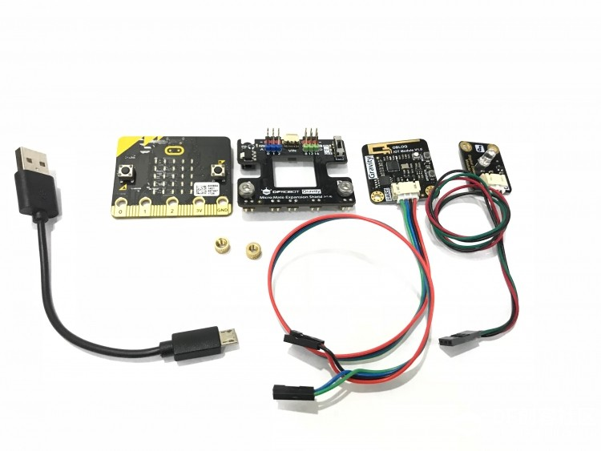
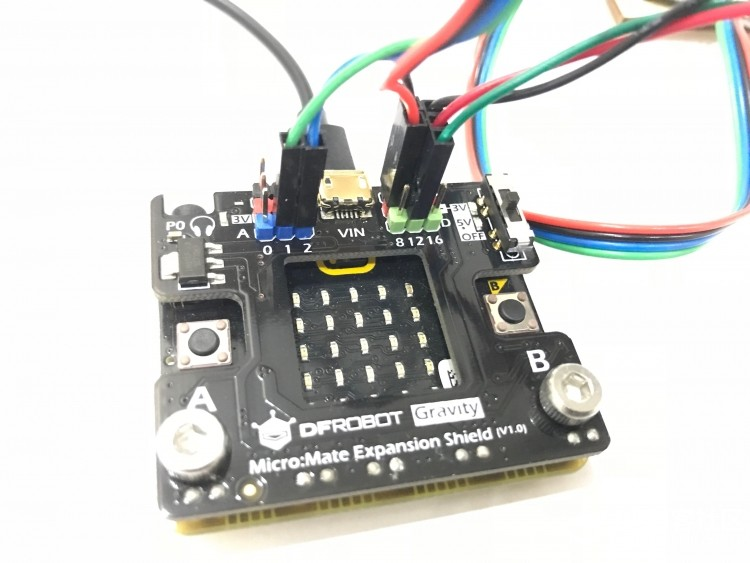
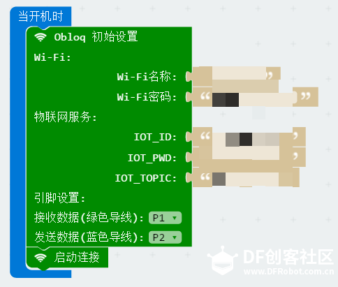
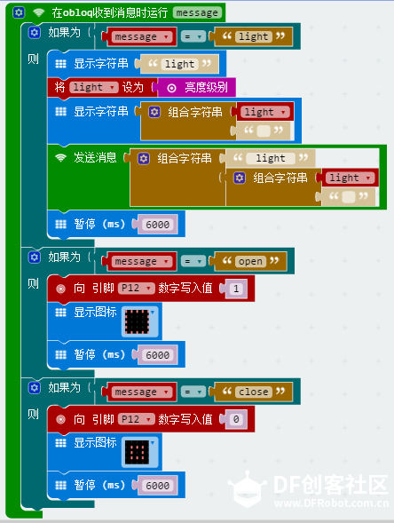

micro:bit+OBloq
===========================

micro:bit简介
-------------------------

    Micro:bit是由英国BBC公司所推出的面向青少年编程教育的微型计算机。Micro:bit电路板上集成了LED灯、两个可编程按钮、加速度传感器、磁力传感器以及蓝牙等常用设备，采用micro USB口供电，可外接电池盒，底部有多个环孔连接器，可用于控制外接设备。
    
    此外，Micro:bit拥有在线的编程网站（https://makecode.microbit.org/），可通过图形化的编程界面，以及支持python或Javascript等多种编程语言的软件进行编程，例如：BXY、Mind+等。
    
    micro:bit购买网址：http://www.dfrobot.com.cn/goods-1395.html
    

硬件连接
------------------------

   从左到右依次为：数据线、micro:bit、Micro:Mate多功能I/O扩展板（还有两个螺母）、OBLOQ物联网模块、LED模块。
   

   LED灯如图接在12号口。12号口高电平，LED灯亮；12号口低电平，LED灯灭。
    

使用MakeCode（Js代码）
---------------------------------

使用BXY（MicroPython代码）
------------------------------------------
