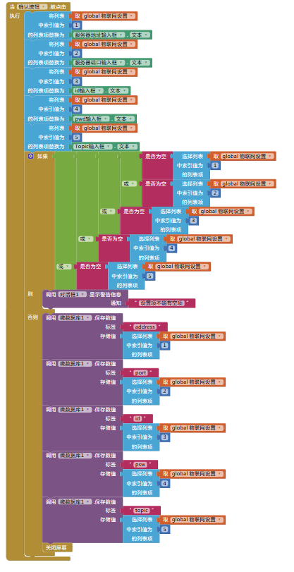
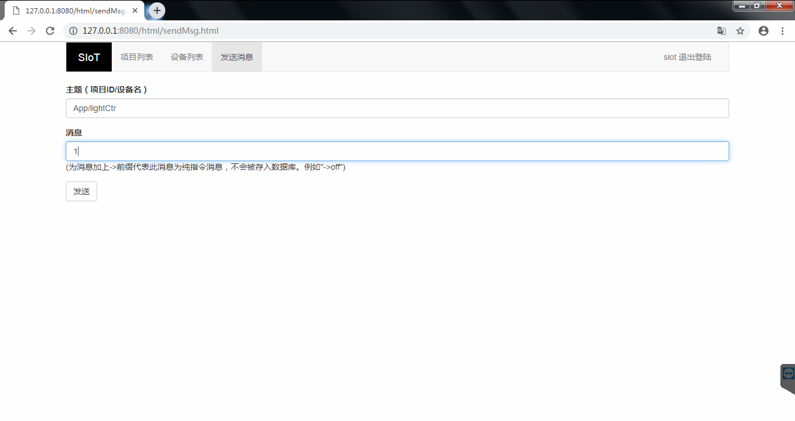
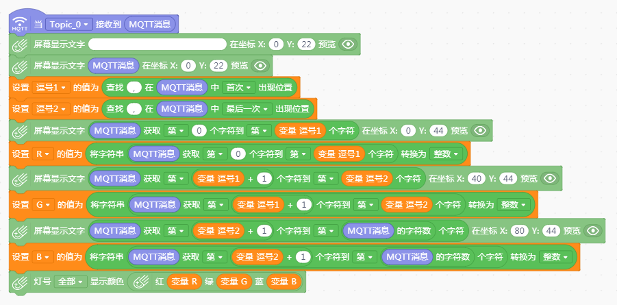

App Inventor2
==============================
　　我们可以通过App Inventor2来实现手机和SIoT之间的通信，从而实现控制掌控板等。

App Inventor2简介
--------------------------------
　　从影音播放、社交网络、聊天通讯、日常生活、办公学习、拍照、美图甚至网购支付等，Android系统的应用已经深入到我们生活中的点点滴滴。那么，你是否萌生过这样的念头：亲自动手制作一个手机应用程序，然后和家人、朋友甚至全世界的人一起分享你的应用程序。或许你底气不足，想到编程就头皮发痒。其实你无需担心，App Inventor 2为零基础代码的人们带来了福音。
    
　　App Inventor 2是一个基于云端的，以图形化形式编程的手机应用程序开发环境。它将枯燥的代码编程方式转变为积木式的图形化编程，同时不同功能代码的积木颜色也不同，这使手机应用程序的开发变得简单而有趣。即使不懂得编程语言的人，也可以开发出属于自己的手机应用程序。
    
　　最初的App Inventor 由Google实验室于2010年7月推出的，2011年8月对外开放源代码。随后交由麻省理工学院移动学习中心（The MIT Centre for Mobile Learning）开发，于2012年3月对外开放使用，并更名为MIT App Inventor 2。2013年12月3日，App Inventor 2 （简称AI2）问世，其新版主页口号是“Your idea, Your design, Your apps, Invent Now”。之前的版本称为App Inventor  Classic或者App Inventor 1，版本之间并不兼容。
    
　　与App Inventor 1相比 ，App Inventor 2的最大优势在于其用Blockly取代了原来的积木编辑器。Blockly是Google发布的完全可视化的编程语言，类似MIT的儿童编程语言Scratch，并且可以很好地在浏览器端运行在浏览器里。无需其他准备，不需要任何准备，打开浏览器你就可以通过类似玩乐高玩具的方式，把一块块图形对象拼接起来构建出应用程序。
  
　　2014年9月14日，MIT推出了App Inventor 2中文版本（含简体和繁体）。10月，在华南理工大学和美国麻省理工学院的直接支持下，广州市教育信息中心部署了国内首台App Inventor 2全功能镜像服务器。广州市教育信息中心的App Inventor 2平台取消诸多限制，界面更加友好，一经推广就受到广大好评,目前已经成为全国的App Inventor 2主要的应用中心。
  
　　广州市教育信息中心的App Inventor 2服务器地址：http://app.gzjkw.net。

编程步骤
-----------------------
**编程准备**

1.本案例以SIoT本地物联网平台为例进行示范(SIoT下载地址：https://github.com/vvlink/SIoT/tree/master/software/SIoT1.1)。

  朋友们也可以注册一个物联网平台账号进行更远距离的控制，在线版物联网平台推荐：DFrobot公司搭建的EasyIot平台（网址：http://iot.dfrobot.com.cn）。
        
2.在广州市教育技术中心的App Inventor2服务器上注册一个账号，服务器网址为：http://app.gzjkw.net。
        
3.下载安装mind+1.5.5版本的编程软件或mpythonX 0.3.1以上的版本。
             
4.准备一块掌控板、一根micro口数据线、一台电脑。

        
**案例：手机App控制掌控板全彩LED灯**  

    
1.手机APP端编程(工具平台：AppInventor2)：

组件设计-setting屏幕组件设计图
                

                
组件设计-screen1屏幕组件设计图

.. image:: ../image/demo/07_appInventor-02.png

逻辑设计-setting屏幕逻辑设计图

.. image:: ../image/demo/07_appInventor-04.png

.. image:: ../image/demo/07_appInventor-06.png

                
逻辑设计-screen1屏幕逻辑设计图

.. image:: ../image/demo/07_appInventor-07.png

.. image:: ../image/demo/07_appInventor-08.png

.. image:: ../image/demo/07_appInventor-09.png

.. image:: ../image/demo/07_appInventor-10.png

.. image:: ../image/demo/07_appInventor-12.png

.. image:: ../image/demo/07_appInventor-13.png

.. image:: ../image/demo/07_appInventor-14.png

    
2.本地物联网平台SIoT的运行并创建设备与主题：

1）运行SIoT本地物联网平台：

.. image:: ../image/demo/07_appInventor-18.png

.. image:: ../image/demo/07_appInventor-19.png

2）登录SIoT，并创建项目（App）与主题（lightCtr）：

.. image:: ../image/demo/07_appInventor-20.png

3.掌控板端编程(工具平台：mind+1.5.5)：

.. image:: ../image/demo/07_appInventor-16.png

