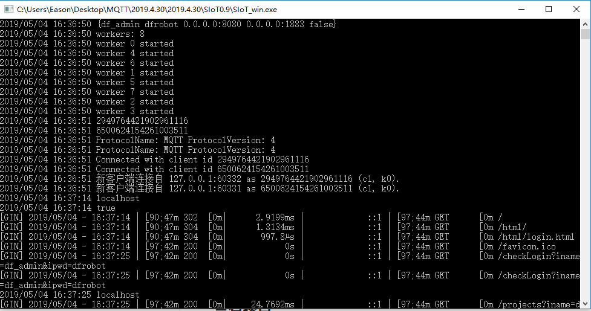
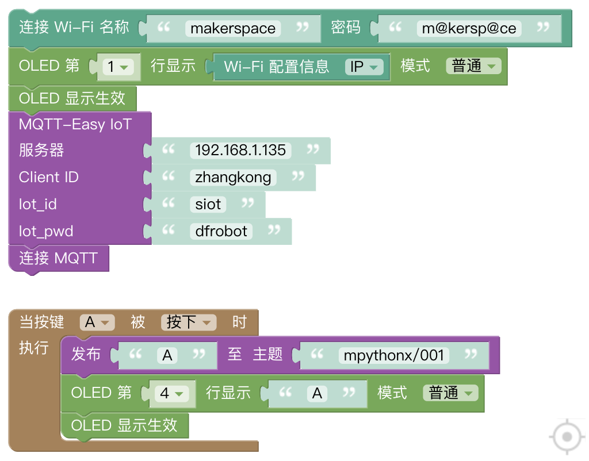
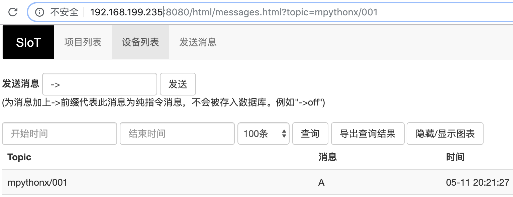

快速入门
=========================

以win7系统为例，介绍SIoT的快速入门。

运行系统：
-------------------

双击运行SIoT_win.exe，将看到一个黑色的CMD窗口，不要关闭它。

编写程序（mPythonX）
--------------------------------

打开mPythonX，编写如下代码。

**说明**：“mpythonx/001”表示项目名称为“mpythonx”，设备名称为“001”。

给掌控板写入程序并且运行。

重新启动掌控板，等屏幕显示IP地址后，按下“A”键，看看屏幕下方是否出现了“A”。

Web管理
----------------------

打开网址：http://127.0.0.1:8080（或者使用电脑的IP地址）。

输入用户名“siot”和密码“dfrobot”，就可以看到项目列表中多了“mpythonx”。

在名称为“001”设备消息中，可以看到掌控板发送过来的信息“A”了。

